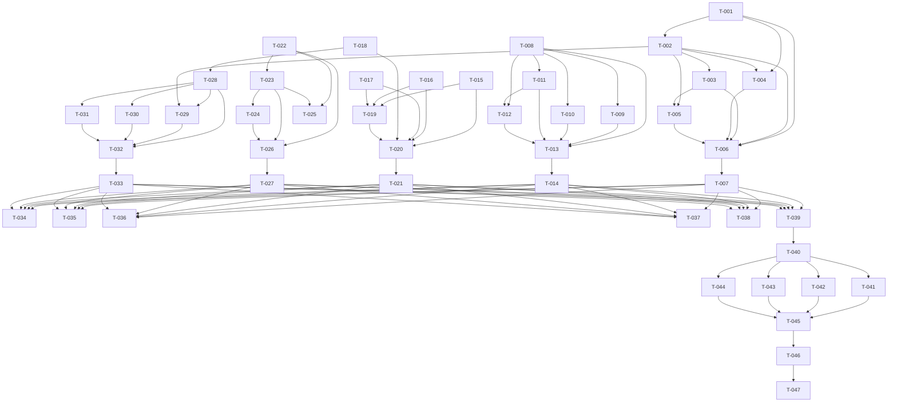

# Dependency Graph

Adjacency list (task -> depends_on):

- T-001 -> []
- T-002 -> [T-001]
- T-003 -> [T-002]
- T-004 -> [T-001, T-002]
- T-005 -> [T-002, T-003]
- T-006 -> [T-001, T-002, T-003, T-004, T-005]
- T-007 -> [T-006]
- T-008 -> []
- T-009 -> [T-008]
- T-010 -> [T-008]
- T-011 -> [T-008]
- T-012 -> [T-008, T-011]
- T-013 -> [T-008, T-009, T-010, T-011, T-012]
- T-014 -> [T-013]
- T-015 -> []
- T-016 -> []
- T-017 -> []
- T-018 -> []
- T-019 -> [T-015, T-016, T-017]
- T-020 -> [T-015, T-016, T-017, T-018, T-019]
- T-021 -> [T-020]
- T-022 -> []
- T-023 -> [T-022]
- T-024 -> [T-023]
- T-025 -> [T-022, T-023]
- T-026 -> [T-022, T-023, T-024]
- T-027 -> [T-026]
- T-028 -> [T-018]
- T-029 -> [T-028, T-002]
- T-030 -> [T-028]
- T-031 -> [T-028]
- T-032 -> [T-028, T-029, T-030, T-031]
- T-033 -> [T-032]
- T-034 -> [T-007, T-014, T-021, T-027, T-033]
- T-035 -> [T-007, T-014, T-021, T-027, T-033]
- T-036 -> [T-007, T-014, T-021, T-027, T-033]
- T-037 -> [T-007, T-014, T-021, T-027, T-033]
- T-038 -> [T-007, T-014, T-021, T-027, T-033]
- T-039 -> [T-007, T-014, T-021, T-027, T-033]
- T-040 -> [T-039]
- T-041 -> [T-040]
- T-042 -> [T-040]
- T-043 -> [T-040]
- T-044 -> [T-040]
- T-045 -> [T-041, T-042, T-043, T-044]
- T-046 -> [T-045]
- T-047 -> [T-046]

Execution waves:

- Wave 1: T-001, T-008, T-015, T-016, T-017, T-018, T-022
- Wave 2: T-002, T-009, T-010, T-011, T-019, T-023, T-028
- Wave 3: T-003, T-004, T-012, T-020, T-024, T-025, T-029, T-030, T-031
- Wave 4: T-005, T-013, T-021, T-026, T-032
- Wave 5: T-006, T-014, T-027, T-033
- Wave 6: T-007
- Wave 7: T-034, T-035, T-036, T-037, T-038, T-039
- Wave 8: T-040
- Wave 9: T-041, T-042, T-043, T-044
- Wave 10: T-045
- Wave 11: T-046
- Wave 12: T-047
