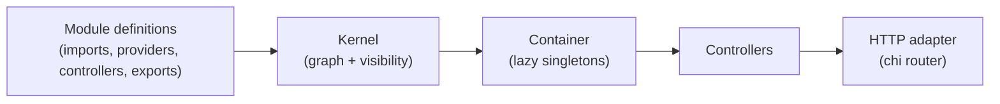
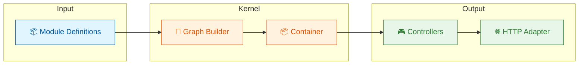

#  modkit

[](https://pkg.go.dev/github.com/go-modkit/modkit)
[](https://github.com/go-modkit/modkit/actions/workflows/ci.yml)
[](https://codecov.io/gh/go-modkit/modkit)
[](https://goreportcard.com/report/github.com/go-modkit/modkit)

[](LICENSE)


**A Go framework for building modular backend services, inspired by NestJS.**

> **Note:** modkit is in **early development**. Read the [Stability and Compatibility Policy](docs/guides/stability-compatibility.md) before adopting in production.

modkit brings NestJS-style module organization to Go—without reflection, decorators, or magic. Define modules with explicit imports, providers, controllers, and exports. The kernel builds a dependency graph, enforces visibility, and bootstraps your app deterministically.

> **⭐ If modkit helps you build modular services, consider [giving it a star](https://github.com/go-modkit/modkit)!**

## What it does

**modkit** takes module definitions and deterministically bootstraps a dependency graph into runnable controllers:



- **Module system**: explicit `imports` / `exports` boundaries
- **Explicit DI**: resolve via tokens (`module.Get[T](r, token)`), no reflection
- **Visibility enforcement**: only exported tokens are accessible to importers
- **Deterministic bootstrap**: predictable init order with clear errors
- **Thin HTTP adapter**: register controllers on a `chi` router

## Why modkit?

modkit is a Go-idiomatic alternative to decorator-driven frameworks. It keeps wiring explicit, avoids reflection, and makes module boundaries and dependencies visible in code.

| If you want... | modkit gives you... |
|----------------|---------------------|
| NestJS-style modules in Go | `imports`, `providers`, `controllers`, `exports` |
| Explicit dependency injection | String tokens + resolver, no reflection |
| Debuggable bootstrap | Deterministic graph construction with clear errors |
| Minimal framework overhead | Thin HTTP adapter on chi, no ORM, no config magic |

### Compared to Other Go Frameworks

| If you use... | modkit is different because... |
|---------------|--------------------------------|
| google/wire   | modkit adds module boundaries + visibility enforcement |
| uber-go/fx    | No reflection, explicit Build functions |
| samber/do     | Full module system with imports/exports |
| No framework  | Structured module organization without boilerplate |

See the [full comparison](docs/guides/comparison.md) for details.

## Requirements

- Go 1.25.x (CI pinned to 1.25.7)

## Installation

### Library

```bash
go get github.com/go-modkit/modkit
```

### CLI Tool

Install the `modkit` CLI using go install:

```bash
go install github.com/go-modkit/modkit/cmd/modkit@latest
```

Or download a pre-built binary from the [releases page](https://github.com/go-modkit/modkit/releases).

## Quickstart (CLI)

Use this as the canonical first-run path:

```bash
modkit new app myapp
cd myapp
go run cmd/api/main.go
curl http://localhost:8080/health
```

Expected output:

```text
ok
```

If this path fails, use the troubleshooting section in [Getting Started](docs/guides/getting-started.md).

## Quick Example

```go
// Define a module
type UsersModule struct{}

func (m *UsersModule) Definition() module.ModuleDef {
    return module.ModuleDef{
        Name: "users",
        Providers: []module.ProviderDef{{
            Token: "users.service",
            Build: func(r module.Resolver) (any, error) {
                return NewUsersService(), nil
            },
        }},
        Controllers: []module.ControllerDef{{
            Name: "UsersController",
            Build: func(r module.Resolver) (any, error) {
                svc, err := module.Get[UsersService](r, "users.service")
                if err != nil {
                    return nil, err
                }
                return NewUsersController(svc), nil
            },
        }},
        Exports: []module.Token{"users.service"},
    }
}

// Bootstrap and serve
func main() {
    app, err := kernel.Bootstrap(&UsersModule{})
    if err != nil {
        log.Fatal(err)
    }
    router := mkhttp.NewRouter()
    mkhttp.RegisterRoutes(mkhttp.AsRouter(router), app.Controllers)
    mkhttp.Serve(":8080", router)
}
```

## Features

- **Module System** — Compose apps from self-contained modules with explicit boundaries
- **Dependency Injection** — Providers built on first access, cached as singletons
- **Visibility Enforcement** — Only exported tokens are accessible to importers
- **HTTP Adapter** — Chi-based router with explicit route registration
- **No Reflection** — Everything is explicit and type-safe
- **Deterministic Bootstrap** — Predictable initialization order with clear error messages

## Feature Matrix

| Pattern | Guide | Example Code | Example Tests |
|---------|-------|--------------|---------------|
| Authentication | [Authentication Guide](docs/guides/authentication.md) | [`examples/hello-mysql/internal/modules/auth/`](examples/hello-mysql/internal/modules/auth/) | [`examples/hello-mysql/internal/modules/auth/integration_test.go`](examples/hello-mysql/internal/modules/auth/integration_test.go) |
| Validation | [Validation Guide](docs/guides/validation.md) | [`examples/hello-mysql/internal/validation/`](examples/hello-mysql/internal/validation/) + [`examples/hello-mysql/internal/modules/users/types.go`](examples/hello-mysql/internal/modules/users/types.go) | [`examples/hello-mysql/internal/modules/users/validation_test.go`](examples/hello-mysql/internal/modules/users/validation_test.go) |
| Middleware | [Middleware Guide](docs/guides/middleware.md) | [`examples/hello-mysql/internal/middleware/`](examples/hello-mysql/internal/middleware/) + [`examples/hello-mysql/internal/httpserver/server.go`](examples/hello-mysql/internal/httpserver/server.go) | [`examples/hello-mysql/internal/middleware/middleware_test.go`](examples/hello-mysql/internal/middleware/middleware_test.go) |
| Lifecycle and Cleanup | [Lifecycle Guide](docs/guides/lifecycle.md) | [`examples/hello-mysql/internal/lifecycle/cleanup.go`](examples/hello-mysql/internal/lifecycle/cleanup.go) + [`examples/hello-mysql/cmd/api/main.go`](examples/hello-mysql/cmd/api/main.go) | [`examples/hello-mysql/internal/lifecycle/lifecycle_test.go`](examples/hello-mysql/internal/lifecycle/lifecycle_test.go) |

## Packages

| Package | Description |
|---------|-------------|
| `modkit/module` | Module metadata types (`ModuleDef`, `ProviderDef`, `Token`) |
| `modkit/config` | Typed environment config module helpers |
| `modkit/kernel` | Graph builder, visibility enforcer, bootstrap |
| `modkit/http` | HTTP adapter for chi router |
| `modkit/logging` | Logging interface with slog adapter |
| `modkit/testkit` | Test harness for bootstrap, overrides, and typed test helpers |

## Architecture



See [Architecture Guide](docs/architecture.md) for details.

## Documentation

**Guides:**
- [Getting Started](docs/guides/getting-started.md) — Your first modkit app
- [Stability and Compatibility Policy](docs/guides/stability-compatibility.md) — Versioning guarantees and upgrade expectations
- [Adoption and Migration Guide](docs/guides/adoption-migration.md) — Incremental adoption strategy and exit paths
- [Fit and Trade-offs](docs/guides/fit-and-tradeoffs.md) — When to choose modkit and when not to
- [Modules](docs/guides/modules.md) — Module composition and visibility
- [Graph Visualization](docs/guides/graph-visualization.md) — Export module graph as Mermaid or DOT
- [Providers](docs/guides/providers.md) — Dependency injection patterns
- [Lifecycle](docs/guides/lifecycle.md) — Provider lifecycle and cleanup
- [Controllers](docs/guides/controllers.md) — HTTP handlers and routing
- [Middleware](docs/guides/middleware.md) — Request/response middleware
- [Interceptors](docs/guides/interceptors.md) — Request/response interception patterns
- [Error Handling](docs/guides/error-handling.md) — Error patterns and Problem Details
- [Validation](docs/guides/validation.md) — Input validation patterns
- [Authentication](docs/guides/authentication.md) — Auth middleware and guards
- [Configuration](docs/guides/configuration.md) — Typed environment configuration patterns
- [Context Helpers](docs/guides/context-helpers.md) — Typed context keys and helper functions
- [Testing](docs/guides/testing.md) — Testing patterns
- [NestJS Compatibility](docs/guides/nestjs-compatibility.md) — Feature parity and Go-idiomatic differences
- [Comparison](docs/guides/comparison.md) — vs Wire, Fx, and others
- [Maintainer Operations](docs/guides/maintainer-operations.md) — Triage SLAs and adoption KPI cadence

**Reference:**
- [API Reference](docs/reference/api.md) — Types and functions
- [Architecture](docs/architecture.md) — How modkit works under the hood
- [FAQ](docs/faq.md) — Common questions
- [Release Process](docs/guides/release-process.md) — CI and versioned CLI release flow

**Examples:**
- [hello-simple](examples/hello-simple/) — Minimal example, no Docker
- [hello-mysql](examples/hello-mysql/) — Full CRUD API with MySQL

## How It Compares to NestJS

| Concept | NestJS | modkit |
|---------|--------|--------|
| Module definition | `@Module()` decorator | `ModuleDef` struct |
| Dependency injection | Constructor injection via metadata | Explicit `module.Get[T](r, token)` |
| Route binding | `@Get()`, `@Post()` decorators | `RegisterRoutes(router)` method |
| Middleware | `NestMiddleware` interface | `func(http.Handler) http.Handler` |
| Guards/Pipes/Interceptors | Framework abstractions | Standard Go middleware |

## Support

- **Questions / ideas**: use [GitHub Discussions](https://github.com/go-modkit/modkit/discussions)
- **Bugs / feature requests**: open a [GitHub Issue](https://github.com/go-modkit/modkit/issues/new/choose)
- **Security**: see [SECURITY.md](SECURITY.md)

## Branding

Branding assets (logo + social preview images) are in
[`assets/branding/stacked-modules/`](assets/branding/stacked-modules/).

## Development

```bash
make fmt
make lint
make vuln
make test
make test-coverage
```

## Community

Questions? Start a [Discussion](https://github.com/go-modkit/modkit/discussions).

## Contributing

See [CONTRIBUTING.md](CONTRIBUTING.md). We welcome issues, discussions, and PRs.

## Contributors

<a href="https://github.com/go-modkit/modkit/graphs/contributors">
  
</a>

## License

MIT — see [LICENSE](LICENSE)
