# Architecture

This guide explains how modkit works under the hood.

## Overview

modkit has three core packages:

```text
modkit/
├── module/   # Module metadata types (ModuleDef, ProviderDef, etc.)
├── kernel/   # Graph builder, visibility enforcer, bootstrap
└── http/     # HTTP adapter for chi router
```

## Bootstrap Flow

When you call `kernel.Bootstrap(rootModule)`:

```mermaid
flowchart TB
    subgraph Input["📥 Input"]
        A[/"Root Module"/]
    end
    
    subgraph Kernel["⚙️ Kernel Processing"]
        B["🔗 Build Graph<br/><small>Flatten imports, detect cycles, validate names</small>"]
        C["👁️ Build Visibility<br/><small>Compute which tokens each module can access</small>"]
        D["📦 Create Container<br/><small>Register provider factories (not built yet)</small>"]
        E["🎮 Build Controllers<br/><small>Call Build functions → triggers provider builds</small>"]
    end
    
    subgraph Output["📤 Output"]
        F[\"Return App"\]
    end
    
    A --> B
    B --> C
    C --> D
    D --> E
    E --> F
    
    style A fill:#e3f2fd,stroke:#1565c0,color:#1565c0
    style B fill:#fff8e1,stroke:#f9a825,color:#f57f17
    style C fill:#fff8e1,stroke:#f9a825,color:#f57f17
    style D fill:#fff8e1,stroke:#f9a825,color:#f57f17
    style E fill:#fff8e1,stroke:#f9a825,color:#f57f17
    style F fill:#e8f5e9,stroke:#2e7d32,color:#2e7d32
```



## Module Graph

Modules declare their dependencies via `Imports`:

```go
type AppModule struct {
    db *DatabaseModule
}

func (m *AppModule) Definition() module.ModuleDef {
    return module.ModuleDef{
        Name:    "app",
        Imports: []module.Module{m.db},  // depends on database
        // ...
    }
}
```

Example module graph:

```mermaid
flowchart TB
    subgraph Root["🏠 AppModule"]
        App["Root Module"]
    end
    
    subgraph Features["📦 Feature Modules"]
        Users["UsersModule"]
        Orders["OrdersModule"]
        Audit["AuditModule"]
    end
    
    subgraph Infrastructure["🔧 Infrastructure"]
        DB["DatabaseModule"]
        Config["ConfigModule"]
    end
    
    App --> Users
    App --> Orders
    App --> Audit
    
    Users --> DB
    Orders --> DB
    Orders --> Users
    Audit --> Users
    
    DB --> Config
    
    style App fill:#fff3e0,stroke:#e65100,color:#e65100
    style Users fill:#e3f2fd,stroke:#1565c0,color:#1565c0
    style Orders fill:#e3f2fd,stroke:#1565c0,color:#1565c0
    style Audit fill:#e3f2fd,stroke:#1565c0,color:#1565c0
    style DB fill:#e8f5e9,stroke:#2e7d32,color:#2e7d32
    style Config fill:#e8f5e9,stroke:#2e7d32,color:#2e7d32
```



The kernel:
1. Flattens the import tree (depth-first)
2. Rejects cycles
3. Rejects duplicate module names
4. Builds a visibility map

## Visibility Rules

A module can access:
- Its own providers
- Tokens exported by modules it imports

```mermaid
flowchart LR
    subgraph DB["📦 DatabaseModule"]
        direction TB
        DB_P["<b>Providers</b><br/>db.connection"]
        DB_E["<b>Exports</b><br/>db.connection"]
    end
    
    subgraph Users["📦 UsersModule"]
        direction TB
        U_I["<b>Imports</b><br/>DatabaseModule"]
        U_A["<b>Can Access</b><br/>✅ db.connection<br/>✅ users.service<br/>❌ db.internal"]
    end
    
    DB_E -->|"export"| U_I
    
    style DB fill:#e3f2fd,stroke:#1565c0,color:#1565c0
    style Users fill:#e8f5e9,stroke:#2e7d32,color:#2e7d32
    style DB_P fill:#bbdefb,stroke:#1565c0,color:#0d47a1
    style DB_E fill:#bbdefb,stroke:#1565c0,color:#0d47a1
    style U_I fill:#c8e6c9,stroke:#2e7d32,color:#1b5e20
    style U_A fill:#c8e6c9,stroke:#2e7d32,color:#1b5e20
```



If a module tries to `Get()` a token it can't see, the kernel returns a `TokenNotVisibleError`.

## Provider Lifecycle

Providers are:
- **Registered** at bootstrap (factory function stored)
- **Built** on first `Get()` call (lazy)
- **Cached** as singletons (subsequent `Get()` returns same instance)


```go
// First call: builds the provider
svc, _ := r.Get("users.service")

// Second call: returns cached instance
svc2, _ := r.Get("users.service")  // same instance as svc
```

Cycles are detected at build time and return a `ProviderCycleError`.

## Controllers

Controllers are built after providers and returned in `App.Controllers`:

```go
app, _ := kernel.Bootstrap(&AppModule{})

// Controllers are ready to use
for name, controller := range app.Controllers {
    fmt.Println(name)  // e.g., "UsersController"
}
```

The HTTP adapter type-asserts each controller to `RouteRegistrar`:

```go
type RouteRegistrar interface {
    RegisterRoutes(router Router)
}
```

## HTTP Adapter

The HTTP adapter is a thin wrapper around chi:


```go
router := mkhttp.NewRouter()  // chi.Router with baseline middleware
err := mkhttp.RegisterRoutes(mkhttp.AsRouter(router), app.Controllers)
mkhttp.Serve(":8080", router)
```

No reflection is used—controllers explicitly register their routes:

```go
func (c *UsersController) RegisterRoutes(r mkhttp.Router) {
    r.Handle(http.MethodGet, "/users", c.List)
    r.Handle(http.MethodPost, "/users", c.Create)
}
```

## Error Types

The kernel returns typed errors for debugging:

| Error | Cause |
|-------|-------|
| `RootModuleNilError` | Bootstrap called with nil |
| `DuplicateModuleNameError` | Two modules share a name |
| `ModuleCycleError` | Import cycle detected |
| `DuplicateProviderTokenError` | Token registered twice |
| `ProviderNotFoundError` | `Get()` for unknown token |
| `TokenNotVisibleError` | Token not exported to requester |
| `ProviderCycleError` | Provider depends on itself |
| `ProviderBuildError` | Provider's Build function failed |
| `ControllerBuildError` | Controller's Build function failed |

## Key Design Decisions

1. **Pointer module identity** — Modules must be pointers so shared imports have stable identity
2. **String tokens** — Simple and explicit; no reflection-based type matching
3. **Explicit Build functions** — You control how dependencies are wired
4. **Singleton only** — One scope keeps the model simple and predictable
5. **No global state** — Everything flows through the App instance
