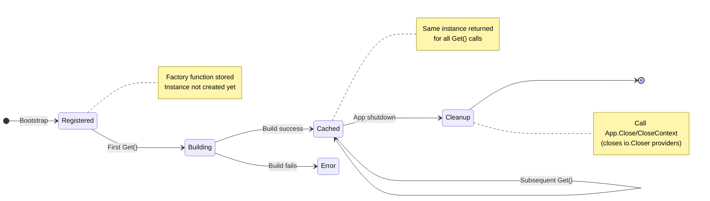

# Provider Lifecycle

This guide explains how providers are created, cached, and cleaned up in modkit.

## Overview

Providers in modkit follow a **lazy singleton** pattern:
- **Lazy**: Built on first `Get()` call, not at bootstrap
- **Singleton**: One instance per provider, cached for the app lifetime

## Lifecycle Stages



## Registration (Bootstrap)

During `kernel.Bootstrap()`, providers are registered but not built:

```go
app, err := kernel.Bootstrap(&AppModule{})
// At this point:
// - Module graph is validated
// - Provider factories are registered
// - No instances have been created yet
```

**What happens:**
1. Module graph is flattened and validated
2. Visibility rules are computed
3. Provider `Build` functions are stored in the container
4. Controllers are built (triggering provider builds as needed)

## Building (First Access)

Providers are built when first accessed via `Get()`:

```go
// In a controller's Build function
svc, err := r.Get("users.service")  // First call: builds the provider
```

**What happens:**
1. Check if the provider is already cached (cache miss on first call)
2. Check if the provider is currently being built (cycle detection)
3. Call the provider's `Build` function
4. Cache the result
5. Return the instance

### Build Order

Build order is determined by access order, not registration order:

```go
module.ModuleDef{
    Providers: []module.ProviderDef{
        {Token: "a", Build: buildA},  // Registered first
        {Token: "b", Build: buildB},  // Registered second
        {Token: "c", Build: buildC},  // Registered third
    },
}

// If you call Get("c") first, the build order is: c, then b, then a
// (assuming c depends on b, and b depends on a)
```

### Cycle Detection

If a provider depends on itself (directly or indirectly), modkit returns a `ProviderCycleError`:

```go
// Bad: A depends on B, B depends on A
{Token: "a", Build: func(r module.Resolver) (any, error) {
    b, _ := r.Get("b")  // A needs B
    return &ServiceA{b: b}, nil
}},
{Token: "b", Build: func(r module.Resolver) (any, error) {
    a, _ := r.Get("a")  // B needs A → cycle!
    return &ServiceB{a: a}, nil
}},
```

**Error:**
```text
ProviderCycleError: cycle detected while building "b": b → a → b
```

## Caching (Singleton Scope)

Once built, providers are cached as singletons:

```go
// First call: builds the provider
svc1, _ := r.Get("users.service")

// Second call: returns cached instance
svc2, _ := r.Get("users.service")

// svc1 and svc2 are the same instance
fmt.Println(svc1 == svc2)  // true
```

**Why singletons?**
- Simple and predictable
- No hidden state or scope management
- Easy to reason about
- Works well for most backend services

## Cleanup and Shutdown

modkit provides explicit shutdown via `App.Close()` / `App.CloseContext(ctx)`. Providers that implement
`io.Closer` are closed in reverse build order when you call these methods.

For a summary of how this compares to NestJS lifecycle hooks, see the [NestJS Compatibility Guide](nestjs-compatibility.md).

### Primary Pattern: App.Close/CloseContext

```go
func main() {
    app, err := kernel.Bootstrap(&AppModule{})
    if err != nil {
        log.Fatal(err)
    }

    router := mkhttp.NewRouter()
    mkhttp.RegisterRoutes(mkhttp.AsRouter(router), app.Controllers)
    if err := mkhttp.Serve(":8080", router); err != nil {
        log.Printf("server error: %v", err)
    }
    if err := app.CloseContext(context.Background()); err != nil {
        log.Printf("shutdown error: %v", err)
    }
}
```

`Close()` closes providers in reverse build order.
Close is idempotent and safe to call: once it completes (even if it returned aggregated errors),
subsequent calls return `nil` and do not re-close providers.

For context-aware shutdown, use `CloseContext(ctx)`:

```go
ctx, cancel := context.WithTimeout(context.Background(), 2*time.Second)
defer cancel()

if err := app.CloseContext(ctx); err != nil {
    // Returns ctx.Err() if canceled or timed out
    log.Printf("shutdown error: %v", err)
}
```

`CloseContext` checks `ctx.Err()` before closing and before each closer. If the context
is canceled or times out, it returns `ctx.Err()` and leaves the app eligible for a
later `Close()` retry. While a close is in progress, concurrent close calls are no-ops.
Use `App.Close()` if you don't need context-aware cancellation behavior.

### Alternative 1: Cleanup in main()

```go
func main() {
    app, err := kernel.Bootstrap(&AppModule{})
    if err != nil {
        log.Fatal(err)
    }
    
    // Get resources that need cleanup
    db, _ := app.Get("db.connection")
    sqlDB := db.(*sql.DB)
    
    // Defer cleanup
    defer sqlDB.Close()
    
    // Start server
    router := mkhttp.NewRouter()
    mkhttp.RegisterRoutes(mkhttp.AsRouter(router), app.Controllers)
    mkhttp.Serve(":8080", router)  // Blocks until shutdown
    
    // Cleanup runs when server exits
}
```

### Alternative 2: Cleanup Provider

Create a provider that tracks resources needing cleanup:

```go
type Cleanup struct {
    funcs []func() error
}

func (c *Cleanup) Register(fn func() error) {
    c.funcs = append(c.funcs, fn)
}

func (c *Cleanup) Run() error {
    var errs []error
    for _, fn := range c.funcs {
        if err := fn(); err != nil {
            errs = append(errs, err)
        }
    }
    if len(errs) > 0 {
        return fmt.Errorf("cleanup errors: %v", errs)
    }
    return nil
}

// In module
{Token: "cleanup", Build: func(r module.Resolver) (any, error) {
    return &Cleanup{}, nil
}},
{Token: "db", Build: func(r module.Resolver) (any, error) {
    cleanup, _ := r.Get("cleanup")
    
    db, err := sql.Open("mysql", dsn)
    if err != nil {
        return nil, err
    }
    
    cleanup.(*Cleanup).Register(db.Close)
    return db, nil
}},

// In main
func main() {
    app, _ := kernel.Bootstrap(&AppModule{})
    cleanup, _ := app.Get("cleanup")
    defer cleanup.(*Cleanup).Run()
    // ...
}
```

### Alternative 3: Context-Based Shutdown

Use context cancellation for coordinated shutdown:

```go
func main() {
    ctx, cancel := context.WithCancel(context.Background())
    defer cancel()
    
    // Pass context to providers that need it
    app, _ := kernel.Bootstrap(&AppModule{ctx: ctx})
    
    // Set up signal handling
    sigCh := make(chan os.Signal, 1)
    signal.Notify(sigCh, os.Interrupt, syscall.SIGTERM)

    go func() {
        <-sigCh
        cancel()  // Signal shutdown to providers using ctx
        shutdownCtx, shutdownCancel := context.WithTimeout(context.Background(), 5*time.Second)
        defer shutdownCancel()
        if err := app.CloseContext(shutdownCtx); err != nil {
            log.Printf("shutdown error: %v", err)
        }
    }()
    
    // Start server
    mkhttp.Serve(":8080", router)  // Graceful shutdown on SIGINT/SIGTERM
}
```

### Pattern 4: signal.NotifyContext Shutdown

Use `signal.NotifyContext` for standard Go signal handling, then shut down the server and close providers:

```go
func main() {
    ctx, stop := signal.NotifyContext(context.Background(), os.Interrupt, syscall.SIGTERM)
    defer stop()

    app, err := kernel.Bootstrap(&AppModule{})
    if err != nil {
        log.Fatal(err)
    }

    router := mkhttp.NewRouter()
    mkhttp.RegisterRoutes(mkhttp.AsRouter(router), app.Controllers)

    srv := &http.Server{
        Addr:    ":8080",
        Handler: router,
    }

    go func() {
        if err := srv.ListenAndServe(); err != nil && !errors.Is(err, http.ErrServerClosed) {
            log.Printf("server error: %v", err)
        }
    }()

    <-ctx.Done()

    shutdownCtx, cancel := context.WithTimeout(context.Background(), 5*time.Second)
    defer cancel()

    if err := srv.Shutdown(shutdownCtx); err != nil {
        log.Printf("server shutdown error: %v", err)
    }

    if err := app.Close(); err != nil {
        log.Printf("app close error: %v", err)
    }
}
```

## Request-Scoped Values

Providers are singletons and cannot be request-scoped. For request-specific data, use `context.Context`:

### Pattern: Context Keys

```go
type contextKey string

const UserKey contextKey = "user"
const RequestIDKey contextKey = "request_id"

// Store in middleware
func AuthMiddleware(next http.Handler) http.Handler {
    return http.HandlerFunc(func(w http.ResponseWriter, r *http.Request) {
        user := authenticateUser(r)
        ctx := context.WithValue(r.Context(), UserKey, user)
        next.ServeHTTP(w, r.WithContext(ctx))
    })
}

// Retrieve in handler
func (c *Controller) Get(w http.ResponseWriter, r *http.Request) {
    user := r.Context().Value(UserKey).(*User)
    // ...
}
```

See [Context Helpers Guide](context-helpers.md) for typed context patterns.

## Comparison with Other Patterns

### vs Uber-go/Fx

| Aspect | Fx | modkit |
|--------|-----|--------|
| Lifecycle hooks | `OnStart`/`OnStop` | `App.Close()` / `CloseContext` |
| Scopes | Singleton, request, custom | Singleton only |
| Automatic cleanup | Yes | Explicit close |

### vs NestJS

| Aspect | NestJS | modkit |
|--------|--------|--------|
| Scopes | Singleton, Request, Transient | Singleton only |
| `onModuleInit` | Provider hook | Not supported |
| `onModuleDestroy` | Provider hook | `App.Close()` / `CloseContext` |
| Request-scoped | Framework-managed | Use `context.Context` |

## Best Practices

1. **Keep providers stateless where possible**
   - Prefer functional transforms over mutable state
   - Stateful providers (e.g., DB pools) should be thread-safe

2. **Initialize expensive resources lazily**
   - Don't open connections in module constructors
   - Let providers build when first needed

3. **Track resources that need cleanup**
   - Implement `io.Closer` and call `app.Close()` / `CloseContext`
   - Or use manual patterns for custom cleanup

4. **Use context for request-scoped data**
   - Don't try to make request-scoped providers
   - Pass `context.Context` through function calls

5. **Test lifecycle explicitly**
   - Bootstrap in tests to verify no cycles
   - Test cleanup logic with real resources

## Example: Database Lifecycle

```go
type DatabaseModule struct {
    dsn string
}

func (m *DatabaseModule) Definition() module.ModuleDef {
    return module.ModuleDef{
        Name: "database",
        Providers: []module.ProviderDef{{
            Token: "db.connection",
            Build: func(r module.Resolver) (any, error) {
                // Lazy: connection opened on first access
                db, err := sql.Open("mysql", m.dsn)
                if err != nil {
                    return nil, fmt.Errorf("open db: %w", err)
                }
                
                // Verify connection
                if err := db.Ping(); err != nil {
                    db.Close()
                    return nil, fmt.Errorf("ping db: %w", err)
                }
                
                // Singleton: same connection pool for all consumers
                return db, nil
            },
        }},
        Exports: []module.Token{"db.connection"},
    }
}

func main() {
    app, _ := kernel.Bootstrap(&AppModule{})
    
    // Get DB for cleanup
    db, _ := app.Get("db.connection")
    defer db.(*sql.DB).Close()
    
    // Start server (DB connection created on first query)
    router := mkhttp.NewRouter()
    mkhttp.RegisterRoutes(mkhttp.AsRouter(router), app.Controllers)
    mkhttp.Serve(":8080", router)
}
```

## Next Steps

- [Modules Guide](modules.md) — Module composition and visibility
- [Providers Guide](providers.md) — Dependency injection patterns
- [Context Helpers](context-helpers.md) — Typed context keys for request-scoped data
- [Testing Guide](testing.md) — Testing lifecycle and cleanup

## See example

- [Lifecycle helpers package](../../examples/hello-mysql/internal/lifecycle/)
- [Cleanup hook execution (LIFO)](../../examples/hello-mysql/internal/lifecycle/cleanup.go)
- [API startup and graceful shutdown flow](../../examples/hello-mysql/cmd/api/main.go)
- [Lifecycle shutdown tests](../../examples/hello-mysql/internal/lifecycle/lifecycle_test.go)
- [App shutdown integration tests](../../examples/hello-mysql/cmd/api/main_test.go)
