# Modules

Modules are the core organizational unit in modkit. They define boundaries, declare dependencies, and control what's visible to other parts of your app.

## ModuleDef

Every module implements the `Module` interface:

```go
type Module interface {
    Definition() ModuleDef
}
```

`ModuleDef` has four key fields:

| Field | Purpose |
|-------|---------|
| `Name` | Unique identifier for the module |
| `Imports` | Other modules this module depends on |
| `Providers` | Services created in this module |
| `Controllers` | HTTP controllers created in this module |
| `Exports` | Tokens visible to modules that import this one |

```go
type AppModule struct {
    db *DatabaseModule
}

func (m *AppModule) Definition() module.ModuleDef {
    return module.ModuleDef{
        Name:    "app",
        Imports: []module.Module{m.db},
        Providers: []module.ProviderDef{
            {Token: TokenService, Build: buildService},
        },
        Controllers: []module.ControllerDef{
            {Name: "AppController", Build: buildController},
        },
        Exports: []module.Token{TokenService},
    }
}
```

## Module Identity

Modules must be passed as pointers to ensure stable identity across shared imports:

```go
// Correct: pass pointer
app, _ := kernel.Bootstrap(&AppModule{})

// Wrong: value type loses identity
app, _ := kernel.Bootstrap(AppModule{})  // rejected
```

If two modules import the same dependency, they must share the same pointer:

```go
dbModule := &DatabaseModule{}

usersModule := &UsersModule{db: dbModule}
ordersModule := &OrdersModule{db: dbModule}  // same pointer

app := &AppModule{
    users:  usersModule,
    orders: ordersModule,
}
```

## Definition() Must Be Deterministic

The kernel may call `Definition()` multiple times during graph construction. It must be side-effect free and return consistent metadata:

```go
// Good: pure function
func (m *AppModule) Definition() module.ModuleDef {
    return module.ModuleDef{
        Name: "app",
        // ...
    }
}

// Bad: side effects
func (m *AppModule) Definition() module.ModuleDef {
    m.counter++  // don't do this
    return module.ModuleDef{...}
}
```

## Tokens and Providers

Tokens are `module.Token` values (strings) that identify providers:

```go
const TokenDB module.Token = "database.connection"

module.ProviderDef{
    Token: TokenDB,
    Build: func(r module.Resolver) (any, error) {
        return sql.Open("mysql", dsn)
    },
}
```

Providers are:
- Built on first `Get()` call (lazy)
- Cached as singletons
- Scoped to module visibility rules

## Controllers

Controllers are built by the kernel and must implement `http.RouteRegistrar`:

```go
type RouteRegistrar interface {
    RegisterRoutes(router Router)
}
```

Example:

```go
module.ControllerDef{
    Name: "UsersController",
    Build: func(r module.Resolver) (any, error) {
        dbAny, err := r.Get(TokenDB)
        if err != nil {
            return nil, err
        }
        return NewUsersController(dbAny.(*sql.DB)), nil
    },
}
```

## Visibility Rules

Visibility is strictly enforced:

```mermaid
flowchart TB
    subgraph DB["📦 DatabaseModule"]
        direction LR
        DB_P["<b>Providers</b><br/>• db.connection<br/>• db.internal"]
        DB_E["<b>Exports</b><br/>• db.connection"]
    end
    
    subgraph Users["📦 UsersModule"]
        direction LR
        U_I["<b>Imports</b><br/>DatabaseModule"]
        U_P["<b>Providers</b><br/>• users.service"]
        U_A["<b>Can Access</b>"]
    end
    
    subgraph Access["Access Check"]
        A1["✅ db.connection<br/><small>exported by DatabaseModule</small>"]
        A2["✅ users.service<br/><small>own provider</small>"]
        A3["❌ db.internal<br/><small>not exported</small>"]
    end
    
    DB_E -->|"exports"| U_I
    U_A --> Access
    
    style DB fill:#e3f2fd,stroke:#1565c0,color:#1565c0
    style Users fill:#fff3e0,stroke:#e65100,color:#e65100
    style Access fill:#fafafa,stroke:#757575,color:#424242
    style A1 fill:#c8e6c9,stroke:#2e7d32,color:#1b5e20
    style A2 fill:#c8e6c9,stroke:#2e7d32,color:#1b5e20
    style A3 fill:#ffcdd2,stroke:#c62828,color:#b71c1c
```



Rules:
- A module can access its own providers
- A module can access tokens exported by modules it imports
- Accessing non-visible tokens returns `TokenNotVisibleError`

## Common Patterns

### Shared Database Module

```go
type DatabaseModule struct {
    dsn string
}

func NewDatabaseModule(dsn string) *DatabaseModule {
    return &DatabaseModule{dsn: dsn}
}

func (m *DatabaseModule) Definition() module.ModuleDef {
    return module.ModuleDef{
        Name: "database",
        Providers: []module.ProviderDef{{
            Token: TokenDB,
            Build: func(r module.Resolver) (any, error) {
                return sql.Open("mysql", m.dsn)
            },
        }},
        Exports: []module.Token{TokenDB},
    }
}
```

### Feature Module with Dependencies

```go
type UsersModule struct {
    db *DatabaseModule
}

func NewUsersModule(db *DatabaseModule) *UsersModule {
    return &UsersModule{db: db}
}

func (m *UsersModule) Definition() module.ModuleDef {
    return module.ModuleDef{
        Name:    "users",
        Imports: []module.Module{m.db},
        Providers: []module.ProviderDef{{
            Token: TokenUsersService,
            Build: func(r module.Resolver) (any, error) {
                db, _ := r.Get(TokenDB)
                return NewUsersService(db.(*sql.DB)), nil
            },
        }},
        Controllers: []module.ControllerDef{{
            Name: "UsersController",
            Build: func(r module.Resolver) (any, error) {
                svc, _ := r.Get(TokenUsersService)
                return NewUsersController(svc.(UsersService)), nil
            },
        }},
        Exports: []module.Token{TokenUsersService},
    }
}
```

### Root App Module


```go
func main() {
    db := NewDatabaseModule(os.Getenv("DB_DSN"))
    users := NewUsersModule(db)
    orders := NewOrdersModule(db, users)
    
    app := &AppModule{
        db:     db,
        users:  users,
        orders: orders,
    }
    
    appInstance, _ := kernel.Bootstrap(app)
    // ...
}
```

## Tips

- Keep module names unique across the graph
- Prefer small modules with explicit exports
- Use constructor functions (`NewXxxModule`) for modules with config
- Export only what other modules need
