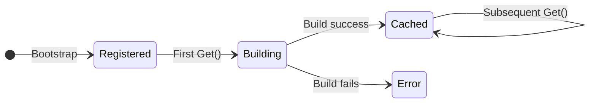

# Providers

Providers are the building blocks of your application's business logic. They encapsulate services, repositories, and any other dependencies that controllers or other providers need.

## What is a Provider?

A provider is a value registered in a module that can be injected into controllers or other providers. In modkit, providers are:

- **Lazy:** Built on first `Get()` call, not at bootstrap
- **Singletons:** Same instance returned for all subsequent calls
- **Scoped:** Only accessible according to module visibility rules

## Defining Providers

Providers are defined in your module's `Providers` field:

```go
type DatabaseModule struct {
    dsn string
}

func (m *DatabaseModule) Definition() module.ModuleDef {
    return module.ModuleDef{
        Name: "database",
        Providers: []module.ProviderDef{
            {
                Token: "db.connection",
                Build: func(r module.Resolver) (any, error) {
                    return sql.Open("mysql", m.dsn)
                },
            },
        },
        Exports: []module.Token{"db.connection"},
    }
}
```

## ProviderDef Fields

| Field | Type | Description |
|-------|------|-------------|
| `Token` | `module.Token` | Unique identifier for the provider |
| `Build` | `func(Resolver) (any, error)` | Factory function that creates the provider value |

## Tokens

Tokens are string identifiers that uniquely identify a provider within the module graph:

```go
// Define tokens as constants for type safety and reuse
const (
    TokenDB          module.Token = "database.connection"
    TokenUsersRepo   module.Token = "users.repository"
    TokenUsersService module.Token = "users.service"
)
```

**Naming conventions:**
- Use dot notation: `module.component` (e.g., `users.service`)
- Keep tokens lowercase
- Be descriptive but concise

## Provider Lifecycle



1. **Registered:** At bootstrap, the factory function is stored (not called)
2. **Building:** On first `Get()`, the factory is invoked
3. **Cached:** The result is stored and returned for all future `Get()` calls

## Resolving Dependencies

Use the `Resolver` to get other providers:

```go
module.ProviderDef{
    Token: TokenUsersService,
    Build: func(r module.Resolver) (any, error) {
        // Get a dependency
        dbAny, err := r.Get(TokenDB)
        if err != nil {
            return nil, err
        }
        db := dbAny.(*sql.DB)
        
        // Get another dependency
        loggerAny, err := r.Get(TokenLogger)
        if err != nil {
            return nil, err
        }
        logger := loggerAny.(Logger)
        
        return NewUsersService(db, logger), nil
    },
}
```

## Error Handling

The `Build` function returns an error for failed initialization:

```go
Build: func(r module.Resolver) (any, error) {
    db, err := sql.Open("mysql", dsn)
    if err != nil {
        return nil, fmt.Errorf("failed to connect to database: %w", err)
    }
    
    // Verify connection
    if err := db.Ping(); err != nil {
        return nil, fmt.Errorf("database ping failed: %w", err)
    }
    
    return db, nil
}
```

Build errors are wrapped in `ProviderBuildError` with context about which provider failed.

## Common Patterns

### Value Provider

For simple values that don't need a factory:

```go
module.ProviderDef{
    Token: "config.port",
    Build: func(r module.Resolver) (any, error) {
        return 8080, nil
    },
}
```

### Factory with Configuration

Capture configuration in the module struct:

```go
type EmailModule struct {
    smtpHost string
    smtpPort int
}

func (m *EmailModule) Definition() module.ModuleDef {
    return module.ModuleDef{
        Name: "email",
        Providers: []module.ProviderDef{{
            Token: "email.sender",
            Build: func(r module.Resolver) (any, error) {
                return NewEmailSender(m.smtpHost, m.smtpPort), nil
            },
        }},
        Exports: []module.Token{"email.sender"},
    }
}
```

### Interface-Based Providers

Define providers against interfaces for testability:

```go
// Interface
type UserRepository interface {
    FindByID(ctx context.Context, id int) (*User, error)
    Create(ctx context.Context, user *User) error
}

// Implementation
type MySQLUserRepository struct {
    db *sql.DB
}

// Provider returns interface type
Build: func(r module.Resolver) (any, error) {
    db, _ := r.Get(TokenDB)
    return &MySQLUserRepository{db: db.(*sql.DB)}, nil
}
```

### Cleanup and Shutdown

For providers that need cleanup (database connections, file handles), handle shutdown in your application:

```go
func main() {
    app, _ := kernel.Bootstrap(&AppModule{})
    
    // ... run server ...
    
    // Cleanup on shutdown
    if db, err := app.Get("db.connection"); err == nil {
        db.(*sql.DB).Close()
    }
}
```

## Cycle Detection

modkit detects circular dependencies at build time:

```go
// This will fail with ProviderCycleError
Provider A → depends on → Provider B → depends on → Provider A
```

Error message:
```text
provider cycle detected: a.service → b.service → a.service
```

**Solution:** Refactor to break the cycle, often by extracting a shared dependency.

## Tips

- Keep provider factories simple—complex logic belongs in the provider itself
- Use interfaces for providers that may have multiple implementations
- Export only the tokens that other modules actually need
- Handle errors explicitly in `Build` functions
- Test providers in isolation before integration testing modules
